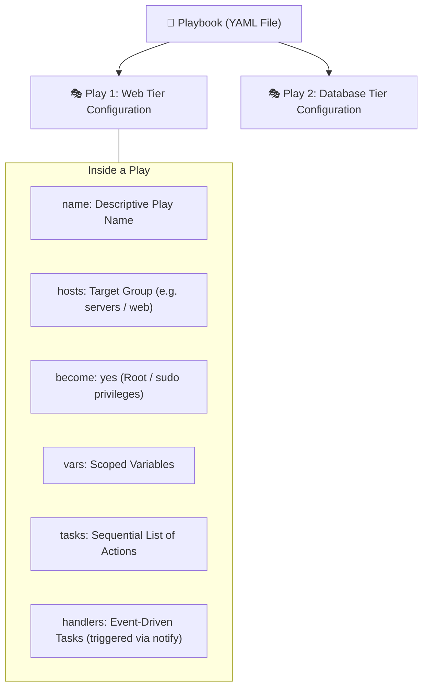

# 🧪 Ansible Playbook Automation Lab

[](https://www.ansible.com/)
[](https://yaml.org/)
[](https://github.com/TrainWithShubham/ansible-in-one-shot/tree/master/modules)

> **Location**: `Playbook/`  
> **Purpose**: A comprehensive experimentation laboratory containing standalone playbooks. Each playbook demonstrates a specific core Ansible concept—from basic variables and Jinja2 templating to web server deployments, loops, OS-level conditionals, enterprise roles, and AES-256 Vault encryption.

---

## 📑 Playbook Anatomy & Keywords Explained

A **Playbook** is a YAML document containing one or more **Plays**. Each Play maps a set of hosts to a list of ordered **Tasks**.



---

## 🗂️ Playbook Catalog & Module Mapping

| Playbook File | Concept Demonstrated | TrainWithShubham Module | Target Group |
| :--- | :--- | :--- | :--- |
| **`hello.yaml`** | Variables & Jinja2 String Interpolation | **Module 01 & 02**: Basics & Variables | `servers` |
| **`setup_nginx.yaml`** | Package cache refresh, custom HTML file copy, service lifecycle | **Module 03**: Templates & Handlers | `servers` |
| **`deploy_nginx.yml`** | End-to-end web server deployment with inline content | **Module 03**: Templates & Handlers | `web` |
| **`install_pkg.yaml`** | Iteration with `loop` and OS filtering with `when` conditionals | **Module 04**: Loops & Conditionals | `all` |
| **`install_docker_with_role.yml`** | Reusable enterprise role execution | **Module 05**: Roles Architecture | `servers` |
| **`show_secrets.yaml`** | Decrypting and consuming AES-256 Ansible Vault files | **Module 06**: Ansible Vault | `servers` |

---

## 💻 Detailed Playbook Walkthrough & Execution Commands

### 1. `hello.yaml`: Variables & Templating
Tests variable scoping and interpolation using `{{ variable_name }}`:
```yaml
- name: hello friends
  hosts: servers
  become: yes

  vars:
    user_name: Pratik

  tasks:
    - name: Greet Users
      command: echo "hello {{ user_name }}"
```
#### How to run:
```bash
ansible-playbook -i ../hosts.ini Playbook/hello.yaml
```

---

### 2. `setup_nginx.yaml`: Web Server Deployment & File Management
Demonstrates updating package caches, copying a custom landing page `index.html` with strict permissions (`mode: '0644'`), and restarting/enabling services:
```yaml
- name: Setup nginx with custom file
  hosts: servers
  become: yes

  tasks:
    - name: Install Nginx
      apt:
        name: nginx
        state: present
        update_cache: yes

    - name: Copy the custom HTML File
      copy:
        src: index.html
        dest: /var/www/html/index.html
        mode: '0644'

    - name: Restart Nginx
      service:
        name: nginx
        state: restarted

    - name: Enable Nginx on Boot
      service:
        name: nginx
        state: started
        enabled: yes
```
#### How to run:
```bash
ansible-playbook -i ../hosts.ini Playbook/setup_nginx.yaml
```

---

### 3. `install_pkg.yaml`: Batch Package Loops & Conditionals
Demonstrates iterating through a list of packages with `loop` and inspecting target node operating system distribution facts with `when`:
```yaml
- name: Install Packages
  hosts: all
  become: yes

  vars:
    packages_to_install:
      - zip
      - unzip
      - jq
      - wget

  tasks:
    - name: Print installation progress
      debug:
        msg: "installing {{ item }}"
      loop: "{{ packages_to_install }}"
      when: ansible_facts["distribution"] == "Ubuntu"

    - name: Install utility packages
      apt:
        name: "{{ item }}"
        state: present
      loop: "{{ packages_to_install }}"
```
#### How to run:
```bash
ansible-playbook -i ../hosts.ini Playbook/install_pkg.yaml
```

---

### 4. `secrets.yaml` & `show_secrets.yaml`: Ansible Vault Integration
Never commit plaintext secrets to Git! `secrets.yaml` is encrypted with AES-256 (`$ANSIBLE_VAULT;1.1;AES256`). `show_secrets.yaml` loads it at runtime using `vars_files`:
```yaml
- name: Show Secrets
  hosts: servers
  become: yes

  vars_files:
    - secrets.yaml

  tasks:
    - name: Show passwords
      debug:
        msg: "My password is {{ password }}"
  
    - name: Show api
      debug: 
        msg: "My api key is {{ api_key }}"
```

#### Vault Management & Execution Commands:
```bash
# 1. Create a password file with strict permissions
echo "my_password" > Playbook/vault_password.txt
chmod 600 Playbook/vault_password.txt

# 2. Encrypt an existing secrets file
ansible-vault encrypt Playbook/secrets.yaml --vault-password-file Playbook/vault_password.txt

# 3. View encrypted secrets without decrypting to disk
ansible-vault view Playbook/secrets.yaml --vault-password-file Playbook/vault_password.txt

# 4. Run the playbook passing the vault password file
ansible-playbook -i ../hosts.ini Playbook/show_secrets.yaml --vault-password-file Playbook/vault_password.txt
```

---

### 5. `install_docker_with_role.yml`: Calling Ansible Roles
Calls the modular enterprise Docker role located in `roles/docker/`:
```yaml
- name: install docker on ubuntu
  hosts: servers
  become: yes
  roles:
    - docker
```
#### How to run:
```bash
ansible-playbook -i ../hosts.ini Playbook/install_docker_with_role.yml
```

---

## ⚡ Useful CLI Flags for Playbook Execution

```bash
# 1. Syntax check (validates YAML syntax without running tasks)
ansible-playbook -i ../hosts.ini Playbook/setup_nginx.yaml --syntax-check

# 2. Dry run / Check Mode (simulates execution without making changes)
ansible-playbook -i ../hosts.ini Playbook/setup_nginx.yaml --check

# 3. Target only a specific host from the group
ansible-playbook -i ../hosts.ini Playbook/setup_nginx.yaml --limit worker-node-1

# 4. Verbose debugging (use -v, -vv, or -vvv for full SSH and module logs)
ansible-playbook -i ../hosts.ini Playbook/setup_nginx.yaml -vvv
```
