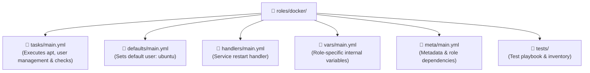

# 🐳 Ansible Role: Docker Installation & Configuration

[](https://galaxy.ansible.com/)
[](https://www.docker.com/)
[](https://github.com/TrainWithShubham/ansible-in-one-shot/tree/master/modules/05-roles)

> **Location**: `Playbook/roles/docker/`  
> **Course Reference**: Directly implements **Module 05: Roles** from [TrainWithShubham's Ansible-in-One-Shot](https://github.com/TrainWithShubham/ansible-in-one-shot/tree/master/modules/05-roles).  
> **Purpose**: A clean, modular, reusable Ansible Role that automates the installation of Docker CE / `docker.io`, configures Linux group permissions, verifies daemon status, and registers output variables.

---

## 📌 What is an Ansible Role? (In Simple Words)

In early stages, developers write all their tasks, handlers, and variables in one large YAML playbook. As your infrastructure grows, this becomes messy and impossible to reuse.

**An Ansible Role breaks your automation into dedicated folders by concern:**
* **`tasks/`**: The action steps (e.g., install packages, run commands).
* **`handlers/`**: Event-driven responses (e.g., restart service when config changes).
* **`defaults/`**: Default variables that users can easily override.
* **`vars/`**: Internal constants specific to the role.
* **`meta/`**: Metadata, author information, and dependencies.

---

## 🏗️ Role Directory Anatomy



---

## ⚙️ What This Role Does Step-by-Step

In `tasks/main.yml`:

1. **System Refresh**: Updates the `apt` package repository cache to guarantee access to the latest packages.
2. **Package Installation**: Installs `docker.io` via the `apt` module.
3. **User Group Management**: Appends the specified user(s) (`{{ docker_user }}`) to the `docker` Linux security group using `append: true`.
   * *DevOps Benefit*: Allows developers to run `docker run` or `docker ps` without prefixing `sudo`!
4. **Register & Verify**: Executes `docker --version`, registers the stdout into `docker_version`, and prints the installed version cleanly using the `debug` module.
5. **Daemon Health Check**: Runs `docker ps` to verify that the Docker daemon socket is actively listening.

---

## 🔧 Role Variables

Variables available for customization in `defaults/main.yml`:

| Variable Name | Default Value | Description |
| :--- | :--- | :--- |
| `docker_user` | `["ubuntu"]` | List of system usernames added to the `docker` group for rootless execution. |

---

## 💻 How to Use This Role

### 1. In Your Playbook
In `Playbook/install_docker_with_role.yml`:

```yaml
---
- name: Install Docker on Ubuntu Servers
  hosts: servers
  become: yes

  roles:
    - docker
```

#### Overriding Variables (Optional):
```yaml
- name: Install Docker with Custom Users
  hosts: servers
  become: yes

  roles:
    - role: docker
      docker_user:
        - ubuntu
        - pratik
        - jenkins
```

---

### 2. Execution Command
From the root directory:
```bash
ansible-playbook -i inventory Playbook/install_docker_with_role.yml
```

---

### 3. Verify Docker on Remote Server
Test Docker execution directly across your nodes:
```bash
# Check Docker version across all servers
ansible -i inventory servers -a "docker --version"

# Run a test container
ansible -i inventory servers -a "docker run --rm hello-world"
```

---

## 💡 TrainWithShubham Multi-OS Comparison

In this repository, you have two implementations of the Docker role:
1. **`Playbook/roles/docker/`** *(This Role)*: Focused on Debian/Ubuntu systems using `apt`.
2. **`termix/playbooks/roles/docker/`**: Advanced multi-OS role featuring a dynamic task dispatcher:
   ```yaml
   include_tasks: "install_{{ ansible_facts['distribution'] | lower }}.yml"
   ```
   Supporting **Ubuntu (`apt`)**, **RHEL (`dnf`)**, and **Amazon Linux (`dnf`)** simultaneously!
