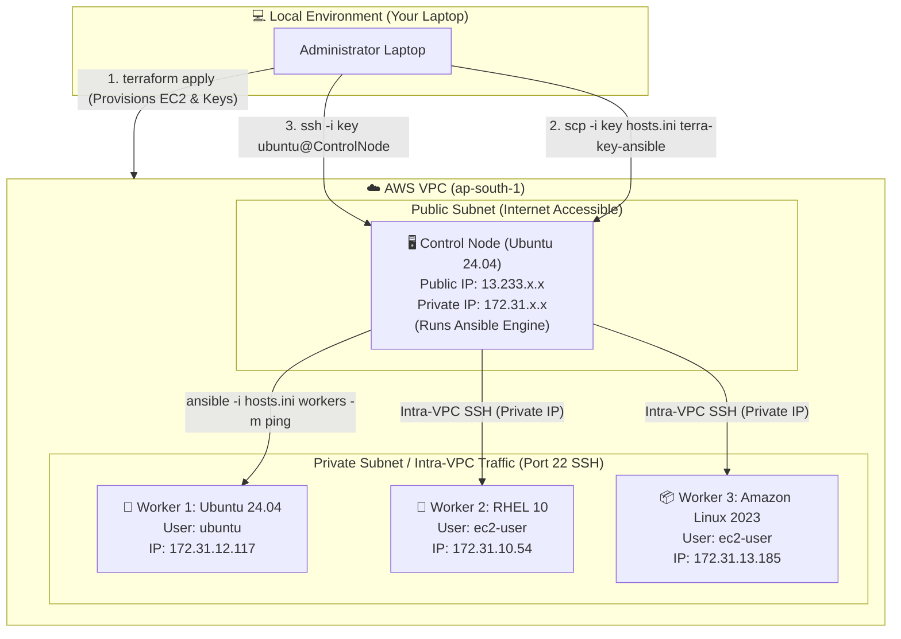
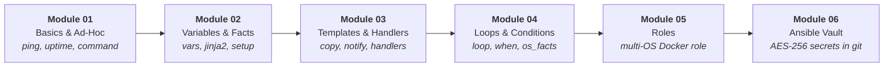

# 🚀 Ansible In One Shot — DevOps Multi-OS Infrastructure & Automation Mastery

[](https://www.ansible.com/)
[](https://www.terraform.io/)
[](https://aws.amazon.com/)
[](https://ubuntu.com/)
[](#)

> **DevOps Engineer Reference**: A comprehensive, production-grade learning journal and practical codebase for **Ansible Automation on AWS**.  
> **Course Curriculum Reference**: Directly aligned with the 6 progressive modules from [TrainWithShubham's Ansible-in-One-Shot](https://github.com/TrainWithShubham/ansible-in-one-shot/tree/master/modules).  
> **Core Concept**: Learn how Terraform provisions a multi-OS cloud cluster and automatically generates Ansible inventories, and how an Ansible **Control Node** orchestrates heterogeneous **Worker Nodes** (Ubuntu, RedHat, Amazon Linux) over AWS private networking.

---

## 📑 Table of Contents

1. [Architectural Overview & Visual Flow](#1-architectural-overview--visual-flow)
   - [AWS Multi-Node VPC Topology](#aws-multi-node-vpc-topology)
   - [The 6-Module Learning Journey (TrainWithShubham Roadmap)](#the-6-module-learning-journey-trainwithshubham-roadmap)
   - [Codebase Repository Structure](#codebase-repository-structure)
2. [Folder 1: `terraform_dynamic_inventory/` (Cloud Infrastructure & Inventory Generator)](#2-folder-1-terraform_dynamic_inventory-cloud-infrastructure--inventory-generator)
3. [Folder 2: `inventories/` (The Server Address Book)](#3-folder-2-inventories-the-server-address-book)
4. [Folder 3: `termix/` (Control Node Production Bundle & Multi-OS Roles)](#4-folder-3-termix-control-node-production-bundle--multi-os-roles)
5. [Folder 4: `Playbook/` (The Automation Recipes Lab)](#5-folder-4-playbook-the-automation-recipes-lab)
6. [Folder 5: `Terraform_ansible/` (Starter Single-Node EC2 Lab)](#6-folder-5-terraform_ansible-starter-single-node-ec2-lab)
7. [Root Level Files & Configurations](#7-root-level-files--configurations)
8. [Module-by-Module Deep Dive (TrainWithShubham Mapping)](#8-module-by-module-deep-dive-trainwithshubham-mapping)
   - [Module 01: Basics & Ad-Hoc Commands](#module-01-basics--ad-hoc-commands)
   - [Module 02: Variables & System Facts](#module-02-variables--system-facts)
   - [Module 03: Templates, Handlers & State Management](#module-03-templates-handlers--state-management)
   - [Module 04: Loops & OS Conditionals](#module-04-loops--os-conditionals)
   - [Module 05: Enterprise Roles Architecture](#module-05-enterprise-roles-architecture)
   - [Module 06: Ansible Vault Security & Secrets](#module-06-ansible-vault-security--secrets)
9. [Master DevOps Command Cheat-Sheet](#9-master-devops-command-cheat-sheet)

---

## 1. Architectural Overview & Visual Flow

### AWS Multi-Node VPC Topology

The infrastructure mirrors real-world enterprise architecture:
1. Your **Laptop** connects to the **Control Node** via its **Public IP**.
2. The **Control Node** manages **3 Worker Nodes** via internal **Private IPs** (`172.31.x.x`) inside the AWS VPC. No worker node needs a public IP for configuration management!



---

### The 6-Module Learning Journey (TrainWithShubham Roadmap)

This repository implements the 6 core pillars of Ansible mastery:



---

### Codebase Repository Structure

```
AWS-DevOps/Ansible/
│
├── terraform_dynamic_inventory/  # 🛠️ Provisions 4 EC2 instances + dynamic inventory
│   ├── ec2.tf                    # EC2 instances, security groups, key pairs
│   ├── variables.tf              # AMIs, instance types, OS families
│   ├── generate_inventory.tf     # Writes hosts.ini & bootstrap.ini using templatefile()
│   ├── templates/                # Jinja-like template files (.tpl)
│   │   ├── inventory.tpl         # Template for private IP worker inventory
│   │   └── bootstrap.tpl         # Template for laptop-to-control bootstrap
│   └── terra-key-ansible         # SSH private key for the cluster
│
├── inventories/                  # 📋 Auto-generated Ansible inventories
│   └── dev/
│       ├── hosts.ini             # Inventory used ON the control node
│       └── bootstrap.ini         # Inventory used FROM laptop
│
├── termix/                       # 📦 Dedicated Control Node Production Bundle
│   ├── hosts.ini                 # Cluster inventory ready for control node
│   ├── keys/                     # SSH key directory template
│   └── playbooks/
│       ├── install_docker.yml    # Master playbook targeting multi-OS workers
│       └── roles/docker/         # Modular enterprise Docker role (Ubuntu, RHEL, Amazon Linux)
│
├── Playbook/                     # 🧪 Standalone Playbook Experimentation Lab
│   ├── hello.yaml                # Variables & echo
│   ├── setup_nginx.yaml          # Nginx install, custom HTML copy, service restart
│   ├── deploy_nginx.yml          # End-to-end Nginx deployment
│   ├── install_pkg.yaml          # Loops (loop) & OS conditionals (when)
│   ├── secrets.yaml              # AES-256 Vault-encrypted credentials
│   ├── show_secrets.yaml         # Playbook demonstrating vars_files with Vault
│   └── install_docker_with_role.yml # Role execution playbook
│
├── Terraform_ansible/            # 🚀 Starter single EC2 instance provisioning lab
├── ansible.cfg                   # ⚙️ Global Ansible configuration defaults
└── README.md                     # 📖 Master documentation
```

---

## 2. Folder 1: `terraform_dynamic_inventory/` (Cloud Infrastructure & Inventory Generator)

### 📌 What is this folder? (In Simple Words)
Instead of manually creating EC2 instances in the AWS console and typing their IP addresses into an Ansible inventory file, this folder uses **Terraform** to:
1. Launch **4 AWS EC2 instances** (1 Control Node + 3 Worker Nodes across Ubuntu, RHEL, and Amazon Linux).
2. Automatically create the SSH Key Pair (`terra-key-ansible`).
3. Automatically render and write the Ansible inventory files into [`inventories/dev/hosts.ini`]  using Terraform's `templatefile()` engine!

---

### 📂 File Breakdown:
* **`ec2.tf`**: Defines the AWS Security Group (opening Port 22 SSH and Port 80 HTTP) and launches the instances using a `for_each` loop over `var.instances`.
* **`variables.tf`**: Defines the configuration map for each machine:
  * `control-node-ubuntu` $\rightarrow$ AMI: Ubuntu Server, SSH user: `ubuntu`
  * `worker-ubuntu` $\rightarrow$ AMI: Ubuntu Server, SSH user: `ubuntu`
  * `worker-redhat` $\rightarrow$ AMI: RHEL 10, SSH user: `ec2-user`
  * `worker-amazon` $\rightarrow$ AMI: Amazon Linux 2023, SSH user: `ec2-user`
* **`generate_inventory.tf`**: Uses `local_file` and `templatefile()` to write `hosts.ini` and `bootstrap.ini`.
* **`templates/inventory.tpl`**: Jinja-style template mapping each server's private IP and SSH username into Ansible groups.

---

### 💻 Step-by-Step Commands:

```bash
# 1. Navigate to the terraform directory
cd terraform_dynamic_inventory/

# 2. Initialize Terraform (downloads AWS and Local providers)
terraform init

# 3. Preview the infrastructure plan
terraform plan

# 4. Apply and create the instances on AWS
terraform apply -auto-approve

# 5. Verify that the inventory file was generated
ls -la ../inventories/dev/hosts.ini
```

> [!TIP]
> **AWS vCPU Quota Note**: Standard AWS accounts have a default limit of 8 vCPUs for On-Demand instances. `t3.micro` instances have 2 vCPUs each ($4 \times 2 = 8\text{ vCPUs}$). If you hit `VcpuLimitExceeded`, switch `instance_type` to `t2.micro` (1 vCPU each) in `variables.tf`.

---

## 3. Folder 2: `inventories/` (The Server Address Book)

### 📌 What is this folder? (In Simple Words)
The **Inventory** is Ansible's telephone directory. Without an inventory, Ansible has no idea which machines exist, how to log into them, or which user account to use (`ubuntu` vs `ec2-user`).

---

### 📂 File Breakdown:

#### 1. [`inventories/dev/hosts.ini`] 
This is the **teaching inventory** designed to be executed **directly on the Control Node**:
```ini
# Ansible Inventory — Auto-generated by Terraform
[all:vars]
ansible_python_interpreter=/usr/bin/python3

[control]
control-node-ubuntu ansible_connection=local ansible_user=ubuntu

[ubuntu_workers]
worker-ubuntu ansible_host=172.31.12.117 ansible_user=ubuntu

[redhat]
worker-redhat ansible_host=172.31.10.54 ansible_user=ec2-user

[amazon]
worker-amazon ansible_host=172.31.13.185 ansible_user=ec2-user

[workers:children]
ubuntu_workers
redhat
amazon

[ubuntu:children]
control
ubuntu_workers
```

#### Why are these groupings brilliant?
* **`[control]`**: Uses `ansible_connection=local` so the control node can configure itself without even making an SSH connection!
* **`[workers:children]`**: Creates an aggregated parent group containing `ubuntu_workers`, `redhat`, and `amazon`. Targeting `workers` runs tasks across all 3 operating systems simultaneously.
* **Per-Host SSH Users**: Notice `worker-ubuntu` has `ansible_user=ubuntu` while `worker-redhat` has `ansible_user=ec2-user`. Ansible automatically swaps users depending on the host!

---

### 💻 Step-by-Step Commands:

```bash
# 1. View your inventory graph (visual tree of groups & hosts)
ansible-inventory -i inventories/dev/hosts.ini --graph

# 2. Ping all worker machines simultaneously
ansible -i inventories/dev/hosts.ini workers -m ping

# 3. Ping only the Ubuntu machines (Control node + Ubuntu worker)
ansible -i inventories/dev/hosts.ini ubuntu -m ping
```

---

## 4. Folder 3: `termix/` (Control Node Production Bundle & Multi-OS Roles)

### 📌 What is this folder? (In Simple Words)
`termix/` is a clean, production-ready directory package structured specifically to live on the **AWS Control Node**. It contains an enterprise-level **Ansible Role** that installs and configures Docker across **Ubuntu, RedHat, and Amazon Linux** with a single command!

---

### 📂 File Breakdown & Architecture:

```
termix/
├── hosts.ini                  # Standalone cluster inventory
├── keys/                      # Directory for the SSH private key
│   └── terra-key-ansible.example
└── playbooks/
    ├── install_docker.yml     # Master playbook invoking the role
    └── roles/
        └── docker/            # Complete Ansible Role structure
            ├── defaults/main.yml    # Default variable values
            ├── handlers/main.yml    # Service restart handler
            ├── meta/main.yml        # Role metadata & author info
            ├── tasks/               # Modular OS tasks!
            │   ├── main.yml         # Main entrypoint with dynamic OS include
            │   ├── install_ubuntu.yml
            │   ├── install_redhat.yml
            │   └── install_amazon.yml
            └── vars/main.yml        # Internal role variables
```

---

### 🧠 How Dynamic OS Dispatching Works (`tasks/main.yml`):
In `termix/playbooks/roles/docker/tasks/main.yml`:
```yaml
- name: Include OS-specific Docker installation
  include_tasks: "install_{{ ansible_facts['distribution'] | lower | replace(' ', '_') }}.yml"
```
When this task runs:
* On Ubuntu $\rightarrow$ Loads `install_ubuntu.yml` (uses `apt` module).
* On RHEL $\rightarrow$ Loads `install_redhat.yml` (uses `dnf` module + adds Docker CE repo).
* On Amazon Linux $\rightarrow$ Loads `install_amazon.yml` (uses `dnf` / amazon-linux-extras).

---

### 💻 Step-by-Step Deployment Commands:

```bash
# ========================================================
# Phase 1: From Your Laptop (Transfer bundle to Control Node)
# ========================================================

# 1. Grab the Control Node's Public IP from Terraform
cd terraform_dynamic_inventory/
export CONTROL_IP=$(terraform output -raw control_node_public_ip)
cd ..

# 2. Securely copy (scp) the termix folder and private key to the Control Node
scp -i terraform_dynamic_inventory/terra-key-ansible -r termix/ ubuntu@$CONTROL_IP:/home/ubuntu/
scp -i terraform_dynamic_inventory/terra-key-ansible terraform_dynamic_inventory/terra-key-ansible ubuntu@$CONTROL_IP:/home/ubuntu/termix/keys/

# 3. SSH into the Control Node
ssh -i terraform_dynamic_inventory/terra-key-ansible ubuntu@$CONTROL_IP

# ========================================================
# Phase 2: On the Control Node (Execute the Automation)
# ========================================================

# 4. Enter the termix directory
cd ~/termix

# 5. Lock down SSH key permissions (mandatory for SSH)
chmod 400 keys/terra-key-ansible

# 6. Test connectivity across all workers
ansible -i hosts.ini workers -m ping

# 7. Execute the multi-OS Docker installation role across all servers!
ansible-playbook -i hosts.ini playbooks/install_docker.yml
```

---

## 5. Folder 4: `Playbook/` (The Automation Recipes Lab)

### 📌 What is this folder? (In Simple Words)
A collection of bite-sized, practical playbooks designed to test and understand each Ansible concept individually (variables, web server deployments, loops, conditionals, and encrypted secrets).

---

### 📂 Playbook Catalog:

#### 1. `Playbook/hello.yaml` — *Variables & Echo*
* **Concept**: Demonstrates Jinja2 variable interpolation `{{ user_name }}`.
* **Command**:
  ```bash
  ansible-playbook -i ../hosts.ini Playbook/hello.yaml
  ```

#### 2. `Playbook/setup_nginx.yaml` & `deploy_nginx.yml` — *Web Server Deployment*
* **Concept**: Updates `apt` cache, installs Nginx, copies a custom `index.html` landing page with `mode: '0644'`, and ensures the service is enabled on boot.
* **Command**:
  ```bash
  ansible-playbook -i ../hosts.ini Playbook/setup_nginx.yaml
  ```

#### 3. `Playbook/install_pkg.yaml` — *Loops & Conditionals*
* **Concept**: Demonstrates `loop: "{{ packages_to_install }}"` iterating through `[zip, unzip, jq, wget]` and conditional execution with `when: ansible_facts["distribution"] == "Ubuntu"`.
* **Command**:
  ```bash
  ansible-playbook -i ../hosts.ini Playbook/install_pkg.yaml
  ```

#### 4. `Playbook/secrets.yaml` & `show_secrets.yaml` — *Ansible Vault*
* **Concept**: Encrypts sensitive API tokens and passwords with AES-256 and imports them at runtime using `vars_files: - secrets.yaml`.
* **Command**:
  ```bash
  # Run using automated password file:
  ansible-playbook -i ../hosts.ini Playbook/show_secrets.yaml --vault-password-file Playbook/vault_password.txt
  ```

---

## 6. Folder 5: `Terraform_ansible/` (Starter Single-Node EC2 Lab)

### 📌 What is this folder? (In Simple Words)
The starting point of the project. A lightweight Terraform setup that provisions a single AWS EC2 instance, creates the `terra-key-ec2` key pair, and exports output variables (Public IP, Instance ID, Private IP). Used for quick single-machine tests before moving to multi-OS clusters.

```bash
cd Terraform_ansible/
terraform init
terraform apply -auto-approve
chmod 400 terra-key-ec2
ansible -i inventory web -m ping
```

---

## 7. Root Level Files & Configurations

| File | Purpose | Key Details |
| :--- | :--- | :--- |
| **`ansible.cfg`** | Global Ansible configuration | Sets `host_key_checking = False` (disables interactive SSH host key prompts in automation) and `inventory = ./inventory`. |
| **`.gitignore`** | Security & repository hygiene | Blocks sensitive files from reaching GitHub: `*.pem`, `terra-key*`, `terraform.tfstate`, and `vault_password.txt`. |
| **`hosts`** & **`inventory`** | Static baseline inventory files | Baseline INI templates showing host definitions and `[all:vars]`. |

---

## 8. Module-by-Module Deep Dive (TrainWithShubham Mapping)

### Module 01: Basics & Ad-Hoc Commands

An **Ad-Hoc command** is a single CLI command executed without writing a playbook file.

#### Command 1: Ping a Group
```bash
ansible -i hosts.ini servers -m ping
```
* `ansible`: The CLI utility.
* `-i hosts.ini`: Path to the inventory file.
* `servers`: Target host or group name.
* `-m ping`: Invokes the `ping` module.
* ⚠️ *Note*: This is **not an ICMP network ping**. It tests SSH connectivity, user credentials, and remote Python interpreter availability, returning `{"ping": "pong"}`.

#### Command 2: Run Arbitrary Linux Commands (`uptime`)
```bash
ansible -i hosts.ini servers -a "uptime"
```
* `-a "uptime"`: Passes arguments to the default module.
* 💡 *Default Module Magic*: When `-m` is omitted, Ansible defaults to `-m command`!
* Therefore, this is identical to: `ansible -i hosts.ini servers -m command -a "uptime"`.

#### `command` vs `shell` Module:
| Feature | `command` Module (`-m command`) | `shell` Module (`-m shell`) |
| :--- | :--- | :--- |
| **Execution** | Directly runs binary via `execve` | Executes command through `/bin/sh -c` |
| **Pipes & Redirects** | ❌ Not supported (`\|`, `>`, `<`) | ✅ Fully supported |
| **Environment Variables** | ❌ Does not expand `$VAR` | ✅ Expands `$HOME`, `$PATH` |
| **Example** | `ansible servers -a "cat /etc/os-release"` | `ansible servers -m shell -a "uptime \| awk '{print \$3}'"` |

---

### Module 02: Variables & System Facts

In Ansible, variables make automation reusable across environments.

#### Playbook Anatomy & Keywords:
```yaml
---
- name: Greet Servers           # 1. Name: Readable description in logs
  hosts: servers                # 2. Hosts: Target inventory group
  become: yes                   # 3. Become: Privilege escalation (sudo)

  vars:                         # 4. Vars: Scoped dictionary of variables
    user_name: Pratik

  tasks:                        # 5. Tasks: Sequential list of actions
    - name: Print greeting
      command: echo "Hello {{ user_name }}"
```

#### Gathering System Facts:
Before tasks execute, Ansible runs `TASK [Gathering Facts]` (the `setup` module). It discovers remote server information stored in the `ansible_facts` dictionary:
* `ansible_facts["distribution"]` $\rightarrow$ `"Ubuntu"`, `"RedHat"`, etc.
* `ansible_facts["os_family"]` $\rightarrow$ `"Debian"`, `"RedHat"`
* `ansible_facts["memtotal_mb"]` $\rightarrow$ Total RAM in MB

---

### Module 03: Templates, Handlers & State Management

#### What is a Handler?
A **Handler** is an event-driven task that only runs when another task makes an actual modification (`changed: true`).

```yaml
tasks:
  - name: Update Nginx Configuration
    copy:
      src: nginx.conf
      dest: /etc/nginx/nginx.conf
    notify: Restart Nginx Service      # <-- Only triggers if file changed!

handlers:
  - name: Restart Nginx Service
    service:
      name: nginx
      state: restarted
```
* **Why this matters**: If the configuration file didn't change, Nginx is **not** restarted, avoiding unnecessary service downtime.
* Handlers execute **once at the very end** of the play, even if 10 tasks notified them!

---

### Module 04: Loops & OS Conditionals

When managing multiple packages or heterogeneous operating systems:

```yaml
vars:
  utility_tools: [zip, unzip, jq, wget]

tasks:
  - name: Install Utilities on Ubuntu
    apt:
      name: "{{ item }}"
      state: present
    loop: "{{ utility_tools }}"                          # Loop over list
    when: ansible_facts["distribution"] == "Ubuntu"     # OS Conditional check
```

---

### Module 05: Enterprise Roles Architecture

A **Role** is the standard, modular way to package tasks, handlers, variables, and templates into clean reusable directories.

```
roles/docker/
├── defaults/main.yml    # Lowest priority default variables
├── vars/main.yml        # Higher priority internal variables
├── tasks/main.yml       # Primary task execution list
├── handlers/main.yml    # Service restart handlers
├── meta/main.yml        # Dependencies and author metadata
└── templates/           # Jinja2 configuration templates
```

In your playbook, you simply call the role:
```yaml
- name: Setup Docker across Cluster
  hosts: workers
  become: yes
  roles:
    - docker
```

---

### Module 06: Ansible Vault Security & Secrets

#### The Problem:
Never push sensitive passwords or API keys to GitHub in plaintext.

#### The Solution:
**Ansible Vault** encrypts files and variables using symmetric **AES-256** encryption (`$ANSIBLE_VAULT;1.1;AES256`).

#### Complete Vault Workflow:

```bash
# 1. Create a password file & lock its permissions (owner read-only)
echo "my_master_password" > vault_password.txt
chmod 600 vault_password.txt

# 2. Encrypt an existing YAML file in-place
ansible-vault encrypt secrets.yaml --vault-password-file vault_password.txt

# 3. View the decrypted contents in terminal WITHOUT decrypting on disk
ansible-vault view secrets.yaml --vault-password-file vault_password.txt

# 4. Edit the encrypted file in your default editor (auto-re-encrypts on save)
ansible-vault edit secrets.yaml --vault-password-file vault_password.txt

# 5. Run a playbook that imports the encrypted secrets
ansible-playbook -i ../hosts.ini show_secrets.yaml --vault-password-file vault_password.txt
```

> [!CAUTION]
> **DevOps Security Rule**: Always ensure `vault_password.txt` is listed inside `.gitignore`. The encrypted `secrets.yaml` is safe to commit to GitHub, but the password file must **never** be committed!

---

## 9. Master DevOps Command Cheat-Sheet

| Action / Goal | Command |
| :--- | :--- |
| **Provision AWS Multi-OS Cluster** | `cd terraform_dynamic_inventory && terraform apply -auto-approve` |
| **Inspect Inventory Tree** | `ansible-inventory -i inventories/dev/hosts.ini --graph` |
| **Transfer Bundle to Control Node** | `scp -i terra-key-ansible -r termix/ ubuntu@<CONTROL_IP>:/home/ubuntu/` |
| **Secure Key Permissions** | `chmod 400 terra-key-ansible` |
| **Ping All Worker Nodes** | `ansible -i hosts.ini workers -m ping` |
| **Check System Memory on Workers** | `ansible -i hosts.ini workers -a "free -h"` |
| **Run Multi-OS Docker Role** | `ansible-playbook -i hosts.ini playbooks/install_docker.yml` |
| **Encrypt Secret File** | `ansible-vault encrypt secrets.yaml --vault-password-file vault_pass.txt` |
| **View Encrypted File** | `ansible-vault view secrets.yaml --vault-password-file vault_pass.txt` |
| **Run Playbook with Vault Secrets** | `ansible-playbook -i hosts.ini playbook.yml --vault-password-file vault_pass.txt` |
| **Syntax Check Playbook** | `ansible-playbook -i hosts.ini playbook.yml --syntax-check` |
| **Dry Run (Check Mode)** | `ansible-playbook -i hosts.ini playbook.yml --check` |

---

## 👨‍💻 Author & Repository Reference
* **Author / Engineer**: Pratik
* **Project**: AWS Cloud DevOps & Configuration Management Automation
* **Curriculum Reference**: [TrainWithShubham/ansible-in-one-shot](https://github.com/TrainWithShubham/ansible-in-one-shot/tree/master/modules)
* **Workspace Path**: `AWS-DevOps/Ansible`
