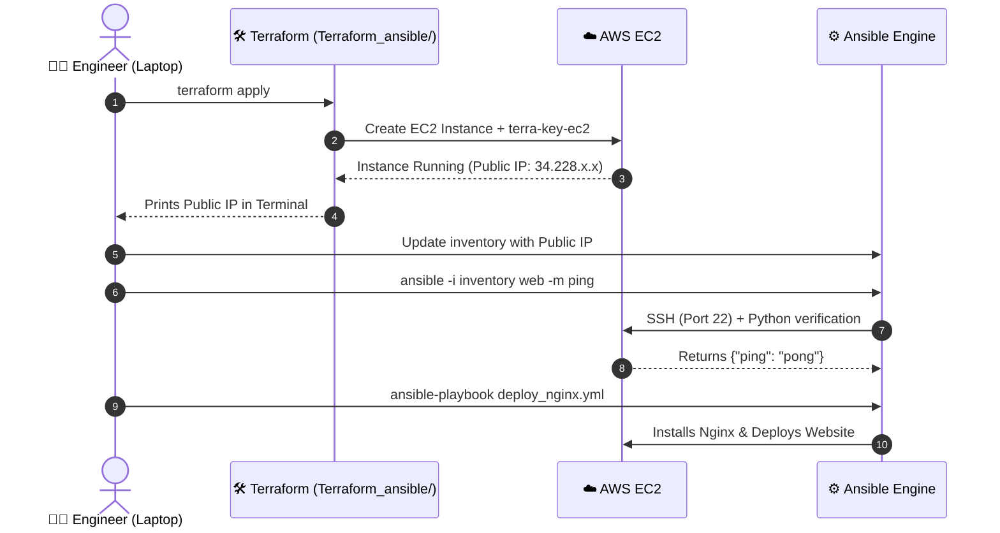

# 🚀 Terraform Single-Node AWS Starter Lab

[](https://www.terraform.io/)
[](https://aws.amazon.com/)
[](https://www.ansible.com/)

> **Location**: `Terraform_ansible/`  
> **Purpose**: The foundational single-instance AWS provisioning lab. Perfect for beginners to master the two-step DevOps loop (Provisioning with Terraform $\rightarrow$ Configuring with Ansible) on a single EC2 server before scaling to multi-node clusters.

---

## 📌 What Does This Folder Do? (In Simple Words)

Before managing multiple heterogeneous Linux operating systems across private subnets, this folder teaches the core fundamental loop:
1. **Infrastructure as Code (IaC)**: Terraform provisions **one Ubuntu EC2 instance** and generates an SSH key pair (`terra-key-ec2`).
2. **Configuration Management**: You take the Public IP output from Terraform, put it into your Ansible `inventory` file, and run ad-hoc commands or playbooks against it.

---

## 🔄 Two-Step DevOps Workflow Diagram



---

## 📂 File Breakdown

| File | Purpose |
| :--- | :--- |
| **`ec2.tf`** | Provisions the AWS EC2 instance, security group (opening Port 22 SSH & Port 80 HTTP), and SSH key pair resource. |
| **`variables.tf`** | Stores customizable inputs like `aws_region`, `instance_type`, and AMI IDs. |
| **`output.tf`** | Exports the newly created instance's Public IP, Private IP, and Instance ID. |
| **`terra-key-ec2`** | Private SSH RSA key file used to log into the created Ubuntu EC2 instance. |
| **`terra-key-ec2.pub`** | Public SSH key uploaded to AWS. |

---

## 💻 Step-by-Step Execution Guide

### Step 1: Provision the Server with Terraform
```bash
# Navigate to the single-node terraform lab
cd Terraform_ansible/

# Initialize provider plugins
terraform init

# Apply configuration and provision the EC2 instance
terraform apply -auto-approve
```
*Note the output `ec2_public_ip` printed in your terminal.*

---

### Step 2: Lock Down SSH Key Permissions
Linux and SSH will reject private keys with permissive permissions:
```bash
chmod 400 terra-key-ec2
```

---

### Step 3: Populate the Ansible Inventory
Go to the root directory and open `inventory`:
```ini
[web]
web1 ansible_host=<YOUR_EC2_PUBLIC_IP>

[web:vars]
ansible_user=ubuntu
ansible_ssh_private_key_file=./Terraform_ansible/terra-key-ec2
```

---

### Step 4: Verify Ansible Connectivity
Run an ad-hoc ping from your root directory:
```bash
ansible -i inventory web -m ping
```
**Expected Output:**
```json
web1 | SUCCESS => {
    "ansible_facts": { "discovered_interpreter_python": "/usr/bin/python3" },
    "changed": false,
    "ping": "pong"
}
```

---

### Step 5: Deploy Nginx via Playbook
```bash
ansible-playbook -i inventory Playbook/deploy_nginx.yml
```
Open `http://<YOUR_EC2_PUBLIC_IP>` in your browser to view the automated landing page!

---

### Step 6: Destroy Server When Finished
```bash
cd Terraform_ansible/
terraform destroy -auto-approve
```

