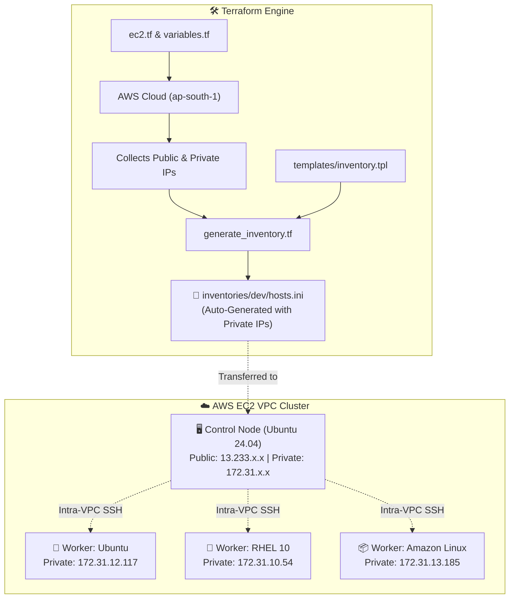

# ☁️ Terraform Dynamic Multi-OS AWS Infrastructure & Inventory Generator

[](https://www.terraform.io/)
[](https://aws.amazon.com/)
[](https://www.ansible.com/)

> **Location**: `terraform_dynamic_inventory/`  
> **Purpose**: Fully automates the creation of a 4-node heterogeneous AWS EC2 cluster (Ubuntu, RHEL, Amazon Linux) and uses Terraform's `templatefile()` engine to dynamically generate the Ansible inventory file.  
> **Course Reference**: Aligned with [TrainWithShubham's Ansible-in-One-Shot](https://github.com/TrainWithShubham/ansible-in-one-shot/tree/master/modules) real-world infrastructure pattern.

---

## 📌 What Does This Folder Do? (In Simple Words)

In traditional setups, engineers manually launch virtual machines in the AWS Console, copy their IP addresses one by one, and manually write an `inventory` or `hosts.ini` file.

**This folder completely automates that entire process:**
1. Terraform connects to AWS and provisions **4 EC2 Instances**:
   * **1 Control Node**: Ubuntu 24.04 (has a Public IP to accept your SSH connection from your laptop).
   * **3 Worker Nodes**: Ubuntu 24.04, RHEL 10, and Amazon Linux 2023 (managed over intra-VPC Private IPs).
2. Terraform creates the SSH key pair (`terra-key-ansible`).
3. Terraform reads the runtime private and public IP addresses of the instances and automatically generates:
   * `inventories/dev/hosts.ini` (used **on** the Control Node to manage workers).
   * `inventories/dev/bootstrap.ini` (used from your laptop for one-time control node setup).

---

## 🏗️ Architecture & Dynamic Generation Flow



---

## 📂 File Breakdown & Responsibilities

| File | Type | What It Does (DevOps Explanation) |
| :--- | :--- | :--- |
| **`ec2.tf`** | Terraform Resource | Provisions the Security Group (`ansible-lab-sg`) with Ports 22 and 80 open, registers the SSH Key Pair, and deploys instances using a `for_each` loop over `var.instances`. |
| **`variables.tf`** | Terraform Variables | Defines default AWS region (`ap-south-1`), instance types (`t3.micro` or `t2.micro`), and the `instances` map containing AMIs, OS families, and default SSH usernames (`ubuntu` vs `ec2-user`). |
| **`generate_inventory.tf`** | Automation Engine | Uses Terraform's `local_file` resource and `templatefile()` to transform instance IP metadata into valid Ansible INI syntax. |
| **`templates/inventory.tpl`** | Template | Jinja-like template used to render `inventories/dev/hosts.ini` with groups `[control]`, `[ubuntu_workers]`, `[redhat]`, `[amazon]`, and aggregated parent group `[workers:children]`. |
| **`templates/bootstrap.tpl`** | Template | Template rendering `bootstrap.ini` containing the Control Node's public IP for initial setup. |
| **`outputs.tf`** | Output Values | Prints Public IPs, Private IPs, and ready-to-copy SSH commands in your terminal after apply. |
| **`terra-key-ansible`** | Private Key | The generated SSH RSA private key used to authenticate with all machines. |

---

## 💻 Step-by-Step Execution Guide

### 1. Initialize Terraform
Downloads the required `hashicorp/aws` and `hashicorp/local` provider plugins:
```bash
terraform init
```

### 2. Preview Planned Resources
Review the execution plan (should show **4 instances to add, 1 security group, 1 key pair, 2 local files**):
```bash
terraform plan
```

### 3. Deploy the Infrastructure to AWS
Creates the instances and writes the inventory files automatically:
```bash
terraform apply -auto-approve
```

### 4. Verify the Auto-Generated Inventory
Check the generated file in the `inventories/` directory:
```bash
cat ../inventories/dev/hosts.ini
```

### 5. Destroy Infrastructure (When Done Learning)
Avoid unnecessary AWS billing by tearing down the cluster when your session ends:
```bash
terraform destroy -auto-approve
```

---
